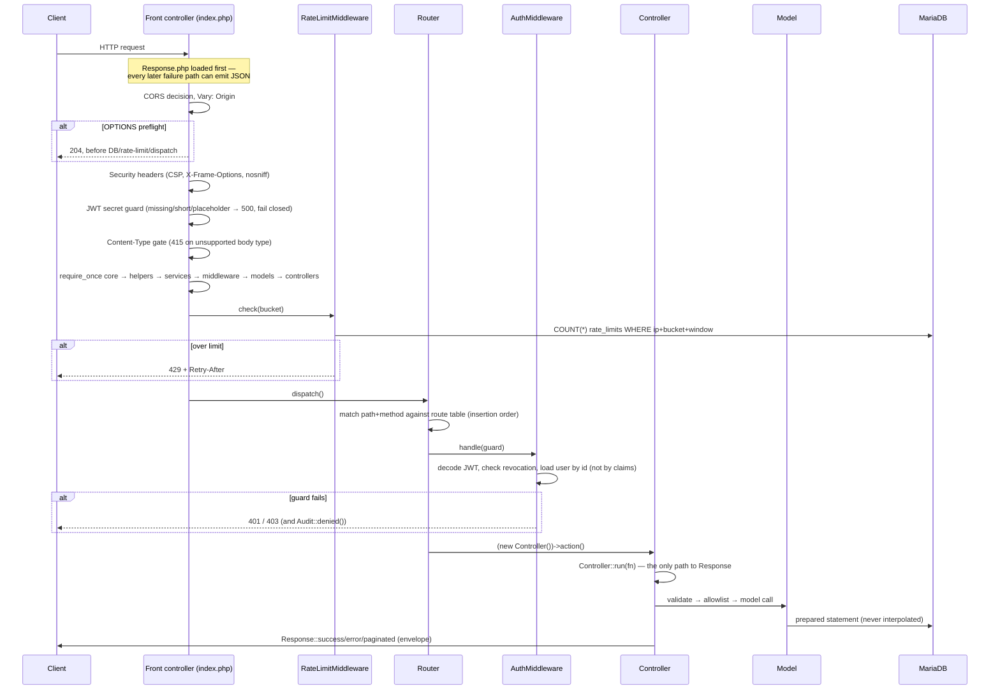
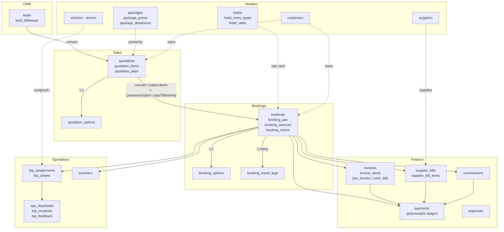

# Architecture

Design decisions and why. For *what* exists, see [REQUIREMENTS.md](REQUIREMENTS.md); for the endpoint list,
[docs/API.md](docs/API.md); for every table, [docs/DATA_MODEL.md](docs/DATA_MODEL.md).

---

## 1. No-Composer PHP

`api/` has no `vendor/`, no autoloader, no `composer.json`. Every class is `require_once`'d explicitly, in
dependency order, inside `api/index.php`: core → helpers → services → middleware → models → controllers. This
is not nostalgia — it is the deployment target. The client's hosting is cheap shared hosting (see
[SECURITY.md](SECURITY.md) and `deploy.sh`), where the whole install step is "upload files via rsync/FTP." No
build step, no `composer install` on the server, no PHP-FPM version negotiation with a lockfile. The cost is
paid once, at review time, by a manual require list; the benefit is paid on every deploy.

Symmetric on the frontend: React 18 + Vite 5, but the *build output* is static files copied into
`public_html/`. The two halves meet at one HTTP boundary — a JSON API — and nothing about the frontend build
leaks into how the backend is deployed, or vice versa.

## 2. The response envelope

Every endpoint returns exactly one shape (`api/core/Response.php`):

```json
{ "success": true, "data": { }, "message": "optional", "pagination": { "optional": "on list endpoints" } }
```

`Response::success()/created()/paginated()/error()` are the only way a controller talks to the client. This
buys three things: the frontend's single fetch wrapper (`frontend/src/lib/api/client.ts`) can unwrap `data`
generically without per-endpoint parsing; a 4xx/5xx is structurally distinguishable from a 2xx by `success`
alone, before even checking the HTTP status; and a new endpoint cannot forget to shape its response, because
`Controller::run()` is the only path that reaches `Response` at all (see §8).

## 3. The route-guard grammar

`api/index.php`'s route table is the entire authorization model, expressed as data:

```php
$router->get('/packages',          [PackageController::class, 'index'],  'staff');
$router->post('/bookings/{id}/cancel', [BookingController::class, 'cancel'], 'staff:owner,manager');
$router->post('/leads',            [LeadController::class, 'store'],     'staff:owner,manager,sales');
$router->post('/auth/login',       [AuthController::class, 'login'],     false);
```

Fourth argument: `false` public · `true` any authenticated user · `'staff'` any staff user · `'staff:a,b'`
staff scoped to roles `a` or `b`. `AuthMiddleware::handle()` evaluates this *before the controller is ever
constructed* — a controller method that would leak a supplier's cost price never runs for a `sales` role,
because it never runs at all.

This earns its keep in exactly one place: `api/tests/authorization_test.php` loads `index.php` with
`ROUTER_TEST_MODE` defined (no database, no dispatch, no secret required) and asserts the guard map as data —
every finance route is `staff:owner,manager,accounts` with no exceptions, every admin route is `staff:owner`,
no route is missing a guard, no route names a role outside `AuthMiddleware::ROLES`, no literal path is shadowed
by an earlier `{id}` pattern. The failure this test exists to catch: someone adds a route and forgets the 4th
argument, which silently defaults to `'staff'` and hands every staff user — including a fresh `sales` hire —
the finance module. A declarative guard is the only shape that makes "assert every route in one test" possible
at all; a guard buried inside fifty individual controller methods is not testable this way.

## 4. Server-side price resolution

`api/services/Pricing.php` carries this rule in its own docblock: *a sell price is never taken from the request
body for anything that resolves to a catalogued item.* The client sends *what* is being sold (package ID,
occupancy, pax counts, travel date); the server decides *how much*, by resolving the applicable
`package_prices` slab, `hotel_rates` contract row, or `activities` sell price. `Pricing::quotePackage()`,
`quoteHotel()`, `quoteActivity()` are the only paths that produce a priced line for a catalogued item, and none
of them accept a price as input.

The one exception is a free-text line (`item_type = 'other'`, no `ref_id`) — a manual quotation/booking line
for something not in the catalogue. That still needs a human-entered price, so the exception is not "trust the
client," it is "trust the *role*": `QuotationController`/`BookingController` check
`Money::equals($discount, …) || $this->canEditPrices()` before accepting a client-supplied discount or manual
unit price, and `canEditPrices()` is `owner`/`manager` only. The price-tampering hole this closes is structural,
not a validation rule that could be bypassed by omission — a `sales` role's request simply never reaches a code
path that writes an arbitrary price.

## 5. The polymorphic payment ledger

One `payments` table (`006_finance.sql`) serves every money movement in the system: booking advances and
instalments, invoice receipts, supplier payments, refunds, commission payouts. The shape is
`ref_type` + `ref_id` + `seq` (instalment number) + `direction` (`in`/`out`) + `amount` + `mode` + `status`. This
buys one reporting surface (`Payment::dayBook()`) for every kind of money the business handles, and one void
path (`Payment::void()`) instead of five.

**Outstanding is never stored.** `bookings.amount_paid` and `invoices.amount_paid` are *caches*, refreshed by
`Booking::refreshPaymentStatus()`/`Invoice::refreshPaymentStatus()` after every payment write — but the actual
outstanding balance shown anywhere in the API (`bookingPayments()`, `Booking::detail()`, ageing reports) is
always computed as `grand_total - Σ(paid, non-void)` at read time, either as a generated SQL expression
(`(b.grand_total - b.amount_paid) AS outstanding`) or a direct `SUM()` query. A stored "outstanding" column
would drift the moment a payment was voided without a corresponding recompute; a computed one cannot drift by
definition.

## 6. Void, not soft-delete, for money

Masters (`destinations`, `suppliers`, `hotels`, …) use `is_deleted` — a hidden row that can come back if
someone unchecks a box. Financial documents (`invoices`, `payments`, `supplier_bills`, `expenses`) use
`voided_by` / `voided_at` / `void_reason` and are **never** `DELETE`d, because a deleted invoice is a hole in a
numbered sequence that an auditor or a tax authority will ask about, and a voided one is a permanent, dated,
attributed record that a mistake happened and was corrected. `Invoice::void()` additionally refuses to void an
invoice with any non-zero `amount_paid` — the payments have to be voided first, in their own auditable step, so
the two facts ("this invoice was wrong" and "this money was returned or reallocated") are never collapsed into
one action.

## 7. Atomic document numbering

`document_sequences(doc_type, period, next_value)` allocates every human-facing number (`QTN-2026-27-0001`,
`BKG-…`, `INV-…`, the new `CASH-…` for cash bills) with one statement, no transaction, no `SELECT … FOR UPDATE`:

```sql
INSERT INTO document_sequences (doc_type, period, next_value)
VALUES (?, ?, LAST_INSERT_ID(2))
ON DUPLICATE KEY UPDATE next_value = LAST_INSERT_ID(next_value + 1)
```

`LAST_INSERT_ID(expr)` both sets and returns the session value, so the read-back is correct on the insert path
(seed 2, subtract 1 → first number is 1) and the update path (the new `next_value`, subtract 1 → the number just
allocated) alike. Two concurrent bookings racing this statement cannot receive the same number — MySQL/MariaDB
serialises the row lock implicit in the `ON DUPLICATE KEY UPDATE` itself; no application-level locking is
needed for something that happens on every single write.

## 8. `SELECT … FOR UPDATE` before a balance-gated write

Document numbering needs no lock because it never *reads* a balance before deciding whether to proceed. Posting
a payment is the opposite: `Payment::postBookingPayment()` calls `Booking::lockForUpdate()` — literally
`SELECT * FROM bookings WHERE id = ? FOR UPDATE` — *inside* the transaction, then re-reads the sum of prior
payments and re-checks `amount <= balance` using that locked row. Without the lock, two concurrent payment
requests can both read the same "balance remaining ₹10,000," both pass the "≤ balance" check, and both commit —
leaving the booking ₹10,000 overpaid with no error raised anywhere. The lock forces the second request to wait
for the first transaction to commit (or roll back) before its own `SELECT … FOR UPDATE` returns, so the second
request's balance read is always current. The same pattern guards supplier-bill payments
(`Payment::postSupplierPayment()`) and booking confirmation against oversold fixed-departure seats
(`BookingController::consumeSeats()`, an atomic `UPDATE … WHERE (seats_total - seats_booked - seats_held) >= ?`
whose own `WHERE` clause *is* the oversell guard, needing no separate lock because the check and the write are
the same statement).

## 9. Explicit collation, everywhere

Every `CREATE TABLE` in every migration ends `DEFAULT CHARSET=utf8mb4 COLLATE=utf8mb4_unicode_ci`, and the PDO
connection pins the same collation on the session (`core/Database.php`,
`PDO::MYSQL_ATTR_INIT_COMMAND => "SET NAMES utf8mb4 COLLATE utf8mb4_unicode_ci, …"`). MariaDB 11.x's server
default collation is `utf8mb4_uca1400_ai_ci` — a different one — and a `JOIN` between a table created under the
server default and one created explicitly fails with errno 1267, "Illegal mix of collations," at query time, in
production, on whichever join happens to be exercised first. Declaring it on every table and the connection
closes the gap at the one place it can be closed for good: nothing about this depends on remembering to set a
session variable correctly in every environment forever.

## 10. The toggle-set table (`quotation_options` / `booking_options`)

This is the newest pattern in the schema, and the one written specifically for this client's "Dynamic
Quotation Builder" (client spec §3). The naïve version bolts nine more columns onto `quotations` and another
nine onto `bookings`: `transport_mode`, `room_category`, `food_included`, `diet_type`, `baggage_included`,
`baggage_notes`, `local_transport_included`, `sightseeing_included`, `insurance_included`. Two tables already
wide with commercial and status columns would each grow a second, unrelated column family — and worse, every
place that reads a quotation or booking row (there are many: `paginate()`, `detail()`, the CSV exporters, the
audit-diff logger) would carry nine columns of payload it usually does not need.

Instead, `quotation_options`/`booking_options` are separate 1:1 tables (`UNIQUE KEY` on `quotation_id` /
`booking_id`), each with exactly one write path — `QuotationOption::upsert()`/`BookingOption::upsert()`, an
`INSERT … ON DUPLICATE KEY UPDATE` covering the whole toggle set at once, because there is no meaningful
"update just one toggle" operation from the UI's point of view; the quotation builder screen submits the whole
form. The payoff that justified the extra table: **conversion is one line**,
`QuotationOption::copyToBooking($quotationId, $bookingId)`, called from
`QuotationController::convert()` — it reads the quote's options row and upserts it onto the new booking,
verbatim, with no per-column special-casing. If the toggles were nine columns on each of two wide tables,
copying them across at conversion would be nine more `array_merge` keys to keep in sync by hand, forever, every
time the toggle set changes. Editing a live booking's toggles after conversion is *not* the same code path as
the copy — `BookingController::saveOptions()` is its own guarded, audited endpoint — because operations changing
what was promised after the fact is a deliberate act that should show up in `audit_log` as `options_updated` on
the *booking*, not be indistinguishable from the original quote's choices.

## 11. Travel legs vs booking services: logistics data is not costed data

`booking_services` and the new `booking_travel_legs` (client spec §4) look superficially similar — both have a
`booking_id`, both describe a leg of the trip — and it would be tempting to add `pnr`/`carrier_name`/`seat_class`
columns to `booking_services` instead of a new table. They are kept apart because they answer different
questions and are owned by different people at different times:

- **`booking_services`** exists from the moment sales prices a booking. It drives billing (`sell_total`) and
  supplier cost (`cost_total`, `supplier_bill_id` once billed) — the row that makes margin
  (`Booking::margin()`) computable. It has no PNR because at pricing time there usually isn't one yet.
- **`booking_travel_legs`** exists once operations enters the *actual* flight/train/bus number and PNR after
  tickets are issued — potentially long after the booking was priced and confirmed, and potentially for a leg
  that was never a costed line at all (a flight the customer booked themselves still needs its timing on the
  printable itinerary handout, per the migration's own comment). It has no cost or sell price because that is
  not what it is for.

Collapsing them into one table would mean either a costed row with a dozen always-NULL logistics columns for
every booking that hasn't ticketed yet, or a logistics row that has to fake a zero-cost service line for a
self-booked flight just to have somewhere to put the PNR. Keeping them separate means `Booking::detail()` can
show `services` (what's billed) and `travel_legs` (what's on the ticket) as two independent, independently-owned
lists that happen to describe the same trip.

## 12. `Invoice::fromBooking()` vs `Invoice::cashBill()`, not one method with a flag

The client's requirement (spec §5) is explicit: "flexible billing — both GST-inclusive invoices and Non-GST
(general/cash) invoices based on customer requirements," and — per the non-negotiable rule in
[REQUIREMENTS.md §0](REQUIREMENTS.md) — the two must never mix on one document. A single `Invoice::raise($type)`
method with `if ($type === 'cash_bill') { … }` branches scattered through the tax computation, the numbering,
and the "does one already exist" guard is exactly the shape that lets a maintainer patch one branch and forget
the other — add a new tax field to the GST path six months from now, and the cash-bill branch silently keeps
computing GST unless someone remembers to touch both halves of one method.

Two separate static methods instead: `Invoice::fromBooking()` computes `Money::splitGst()` (CGST+SGST for
intra-state, IGST for inter-state) from the booking's `gst_amount`, draws from the `INV-…` sequence, and guards
uniqueness against `invoice_type = 'tax_invoice'`. `Invoice::cashBill()` — its sibling, not a branch inside the
same function — sets every tax column to a literal `0.00`, sets `is_gst_applicable = 0`, draws from the
independent `CASH-…` sequence, and guards uniqueness against `invoice_type = 'cash_bill'` separately, so a
booking can legitimately hold one of each without either check tripping the other. Each method is short enough
to read start to finish and see that it *cannot* compute a tax figure it isn't supposed to — there is no `if`
to get wrong. `FinanceController::raiseInvoice()` and the sibling `FinanceController::raiseCashBill()` mirror the
same split one layer up, so which document type gets raised is a routing decision
(`POST /bookings/{id}/invoice` vs `POST /bookings/{id}/cash-bill`), not a parameter a client could send
incorrectly to the wrong effect.

---

## Request lifecycle

Every request to `api/index.php` passes through the same fourteen stages, in this order, before a controller
method runs — see the numbered comment block at the top of `api/index.php` for the authoritative list. The
order is load-bearing, not stylistic:



## Module dependency diagram



---

## What this project deliberately did NOT copy from the reference stack

Per `docs/REFERENCE_STACK_ANALYSIS.md`, several patterns were flagged as debt in the source repo and rejected
here from day one rather than fixed later: react-hook-form + zod wired everywhere instead of installed-but-
unused, `tsconfig strict: true` from the start, one shared `DataTable` component instead of copy-pasted inline
tables, React Query as the only GET cache, routes split by concern in `api/index.php`'s comment structure. See
the reference doc for the full list; this file only restates it where it materially shaped a decision above.
