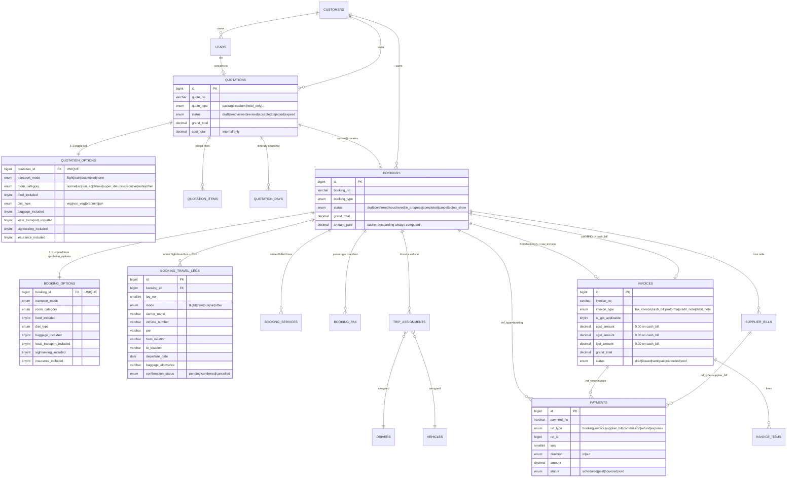

# Data Model

59 tables across 11 migrations (`api/migrations/001_core.sql` … `011_travel_legs.sql`), all idempotent
(`CREATE TABLE IF NOT EXISTS`, `ADD COLUMN IF NOT EXISTS`, or a naturally-idempotent `MODIFY COLUMN` on an
ENUM). `database/build-schema.sh` concatenates them into `database/schema.sql` for reference; the migrations
themselves remain the source of truth.

---

## Conventions

- **Primary key:** `id BIGINT UNSIGNED NOT NULL AUTO_INCREMENT` on every table, no exceptions and no
  `<entity>_id INT` legacy shape anywhere in this schema (a problem the reference stack analysis flagged in a
  different, older codebase and this project fixed at the start — see `docs/REFERENCE_STACK_ANALYSIS.md`).
- **Money:** always `DECIMAL(15,2)`, never `FLOAT`. Rates/percentages: `DECIMAL(6,3)`. FX rates:
  `DECIMAL(12,6)`. Every comparison in PHP goes through `Money::equals()`/`greaterThan()`/`lessThan()`
  (`EPSILON = 0.005`) — never a raw `==`.
- **Charset/collation:** `DEFAULT CHARSET=utf8mb4 COLLATE=utf8mb4_unicode_ci` declared explicitly on every
  `CREATE TABLE`, because the MariaDB 11.x server default (`utf8mb4_uca1400_ai_ci`) breaks every `JOIN` across
  tables with errno 1267. See [ARCHITECTURE.md §9](../ARCHITECTURE.md#9-explicit-collation-everywhere).
- **Audit columns:** `created_at TIMESTAMP … DEFAULT CURRENT_TIMESTAMP`, `updated_at … ON UPDATE
  CURRENT_TIMESTAMP` on every mutable table, plus `created_by BIGINT UNSIGNED NULL` on anything created by a
  user action.
- **Delete semantics:** masters carry `is_deleted TINYINT(1)` (soft delete via `Model::softDelete()`); financial
  documents carry `voided_by`/`voided_at`/`void_reason` instead and are never `DELETE`d.
- **Index naming:** `uq_<table>_<col>` (unique), `idx_<table>_<col>` (non-unique). No `fk_*` — foreign keys are
  enforced in application code (`Model::findOrFail()` before insert), not as DB constraints, so a migration can
  be re-run against partially-seeded data without FK-order headaches on shared hosting.
- **Status transitions:** entities with a lifecycle (`leads`, `quotations`, `bookings`, `trip_assignments`, …)
  carry both `status` and `previous_status`, so a transition can be inspected or reverted without a separate
  history read — `workflow_history` additionally logs every transition with an actor and a note for anything
  that needs a full timeline.

---

## Domain: Identity & Security (`001_core.sql`)

| Table | Purpose | Key columns |
|---|---|---|
| `users` | Staff, B2B agent, or (future) customer accounts | `user_type` (staff/agent/customer), `staff_role` (validated against `AuthMiddleware::ROLES` in PHP, not a DB enum), `agency_id`, `failed_logins`, `locked_until`, `must_change_pw` |
| `refresh_tokens` | Rotating refresh tokens | `token_hash` (sha256, never the raw token), `client_type`, `expires_at`, `revoked_at` |
| `revoked_tokens` | Access-token (`jti`) denylist until natural expiry | `jti_hash`, `expires_at` |
| `password_resets` | One-time reset tokens | `token_hash`, `expires_at` (15 min), `used_at` |
| `rate_limits` | DB-backed rate limiting | `ip`, `bucket`, `created_at` **INT** (epoch, not TIMESTAMP — written on every request) |
| `audit_log` | Every write in the system | `action`, `entity_type`/`entity_id` (polymorphic), `old_value`/`new_value` (JSON), redacts password-shaped fields |

## Domain: Cross-cutting infrastructure (`001_core.sql`)

| Table | Purpose | Key columns |
|---|---|---|
| `settings` | Operator-tunable config, closed key space | `setting_key` (PK), `value_type`, `is_public` |
| `document_sequences` | Atomic numbering | `(doc_type, period)` PK, `next_value` |
| `attachments` | Polymorphic file store | `entity_type`/`entity_id`/`category`, `file_path` (random, never client-controlled) |
| `notifications` | Per-user or per-role inbox | `user_id` (NULL = role broadcast), `kind`, `severity` |
| `import_jobs` / `import_job_rows` | Per-row bulk import (a bad row never rejects the whole file) | `status` per job and per row |
| `workflow_history` | Generic status-transition log | `entity_type`/`entity_id`, `from_status`/`to_status`, `actor_id` |

## Domain: Geography & Suppliers (`002_masters.sql`)

| Table | Purpose | Key columns |
|---|---|---|
| `countries` | Reference list | `iso2`, `visa_required` |
| `destinations` | The sellable geography unit (Goa, Bali, …) | `scope` (domestic/international) — drives TCS applicability |
| `cities` | Under a destination | `airport_code` |
| `suppliers` | Every kind of vendor | `supplier_type` (hotel/transport/activity/dmc/airline/visa/insurance/guide), `gstin`, `credit_days`, `rating` |
| `hotels` | | `category` ENUM incl. `2star` (client req R4, `009_client_vocab_patch.sql`) |
| `hotel_room_types` | | `room_category` ENUM (added `009`, **not yet settable via the API** — REQUIREMENTS.md T4) |
| `hotel_rates` | Season-dated contracted cost, per room-night or per-person | `meal_plan` (EP/CP/MAP/AP), `cost_single/double/triple` |
| `vehicle_types` / `vehicles` / `drivers` | Fleet | `is_owned`, licence/permit/insurance/fitness/PUC expiries |
| `transport_rates` | Point-to-point or per-day disposal rate card | `rate_type`, `base_cost`, `included_km` |
| `activities` | Sightseeing/adventure/cruise/… | `pricing_basis` (per_person/group/vehicle), `cost_adult`/`sell_adult` |
| `agencies` | B2B sub-agents who resell packages | `commission_pct`, `credit_limit` |
| `customers` | The traveller / lead owner | `customer_type` (individual/corporate/agency), `gstin` for corporate billing |

## Domain: Packages & Pricing (`003_packages.sql`)

| Table | Purpose | Key columns |
|---|---|---|
| `packages` | Sellable itinerary product | `package_type` (fixed_departure/customised/fit/group/honeymoon/pilgrimage/corporate/mice), `scope`, `markup_pct`, `gst_pct` |
| `package_days` | Day-by-day itinerary | `day_no` unique per package, `meal_plan` |
| `package_day_items` | What each day consumes | `item_type` (widened to incl. `bus` in `009`), `ref_id` |
| `package_prices` | The authoritative sell price: pax band × occupancy × hotel category × season | `hotel_category` (widened to incl. `2star` in `009`), `price_single/double/triple`, `cost_per_adult` |
| `package_departures` | Fixed-departure batches with seat inventory | `seats_total/booked/held` — availability always computed, never stored |

## Domain: CRM (`004_crm.sql`)

Implements client spec §2.

| Table | Purpose | Key columns |
|---|---|---|
| `lead_sources` | Walk-in, WhatsApp, Referral, Instagram, … | `is_paid` |
| `leads` | The enquiry | `status` (new/contacted/quoted/negotiating/won/lost/dropped), `priority`, `converted_booking_id` |
| `lead_followups` | Call/WhatsApp/email/meeting log | `outcome`, `next_due_at` |
| `quotations` | The quote | `quote_type` (Full Package vs Independent — added `009`), `status` (draft/sent/viewed/revised/accepted/rejected/expired), `version`/`parent_quote_id` (revision chain), `cost_total`/`margin_amount` (internal, stripped for non-cost-visible roles) |
| `quotation_items` | Priced lines | `item_type` (widened to incl. `bus` in `009`), `unit_cost` (internal) vs `unit_price` (client-facing) |
| `quotation_days` | Itinerary **snapshot** — later package edits never rewrite a sent quote's history | `hotel_name`, `meal_plan` |

## Domain: Quotation Builder toggles — NEW (`010_quotation_builder.sql`)

Implements client spec §3 in full. A **separate 1:1 table** rather than more columns on `quotations`/`bookings`
— see [ARCHITECTURE.md §10](../ARCHITECTURE.md#10-the-toggle-set-table-quotation_options--booking_options) for
why.

**`quotation_options`** — one row per quotation, `UNIQUE KEY (quotation_id)`:

| Column | Type | Notes |
|---|---|---|
| `transport_mode` | ENUM(`flight,train,bus,mixed,none`) | Client §3B |
| `room_category` | ENUM(`normal,ac,non_ac,deluxe,super_deluxe,executive,suite,other`) | Client §3C |
| `food_included` | TINYINT(1) | Client §3D |
| `diet_type` | ENUM(`veg,non_veg,brahmin,jain`) | Client §3D |
| `baggage_included` | TINYINT(1) + `baggage_notes VARCHAR(255)` | Client §3E |
| `local_transport_included` | TINYINT(1) | Client §3E |
| `sightseeing_included` | TINYINT(1) | Client §3E |
| `insurance_included` | TINYINT(1) | Client §3E |

**`booking_options`** — identical shape, `UNIQUE KEY (booking_id)`. Populated by
`QuotationOption::copyToBooking()` at conversion; editable afterward as its own audited action
(`BookingController::saveOptions()`).

## Domain: Bookings (`005_bookings.sql`)

| Table | Purpose | Key columns |
|---|---|---|
| `bookings` | The confirmed trip | `booking_type` (shares vocabulary with `quote_type`), `status` (draft/confirmed/vouchered/in_progress/completed/cancelled/no_show), `payment_status` (unpaid/advance_paid/partially_paid/paid/refunded/overpaid), `amount_paid` (cache — outstanding always computed as `grand_total - amount_paid`), `cancellation_charge`/`refund_amount` |
| `booking_pax` | Passenger manifest | `pax_type`, passport/visa fields, `meal_preference` ENUM (widened to incl. `brahmin` in `009` — **but `BookingController::savePax()`'s in-code allowlist still omits it**, REQUIREMENTS.md T5) |
| `booking_services` | Costed/billed lines — drives margin | `service_type` (widened to incl. `bus` in `009`), `unit_cost` vs `unit_price`, `supplier_status`, `supplier_bill_id` |
| `booking_rooms` | Rooming list | `occupancy`, `pax_ids` (comma-separated), `hotel_room_no` (filled at check-in) |
| `vouchers` | Client-facing generated documents | `voucher_type` (hotel/transport/activity/flight/tour/visa/insurance), `content_json` (PDF snapshot) |
| `cancellation_policies` | Days-before-departure → charge slabs | `scope_type` (global/package/destination), `charge_type` (percent/fixed) |

## Domain: Travel Legs — NEW (`011_travel_legs.sql`)

Implements client spec §4 (actual flight/train/bus numbers, PNR, timings, baggage rules). Deliberately separate
from `booking_services` — see
[ARCHITECTURE.md §11](../ARCHITECTURE.md#11-travel-legs-vs-booking-services-logistics-data-is-not-costed-data).

**`booking_travel_legs`**:

| Column | Type | Notes |
|---|---|---|
| `leg_no` | SMALLINT UNSIGNED | `UNIQUE (booking_id, leg_no)`, renumbered from 1 on replace |
| `mode` | ENUM(`flight,train,bus,car,other`) | |
| `direction` | ENUM(`onward,return,internal`) | |
| `carrier_name` | VARCHAR(120) | Airline / rail operator / bus company |
| `vehicle_number` | VARCHAR(30) | Flight no / train no / bus no |
| `pnr` | VARCHAR(20) | |
| `seat_class` | VARCHAR(40) | "Economy", "Sleeper 3AC", … |
| `from_location`/`to_location` | VARCHAR(160) | Required |
| `departure_date` | DATE | Required |
| `departure_time`/`arrival_date`/`arrival_time` | TIME/DATE/TIME | Optional; arrival cannot precede departure (`TravelLeg::assertLegShape()`) |
| `baggage_allowance` | VARCHAR(120) | Finalised baggage rule, e.g. "15kg check-in + 7kg cabin" |
| `confirmation_status` | ENUM(`pending,confirmed,cancelled`) | Set to `confirmed` via the `/confirm` endpoint once the PNR is issued |
| `sort_order` | SMALLINT UNSIGNED | Display order on the (not-yet-built) itinerary handout |

Driver/vehicle assignment for pickup, drop-off and sightseeing (client §4) is **not** part of this table — it
was already covered by `trip_assignments` + `drivers` (below), which is why `011` adds no columns there.

## Domain: Finance (`006_finance.sql`)

| Table | Purpose | Key columns |
|---|---|---|
| `invoices` | Receivable-side documents | `invoice_type` ENUM(`tax_invoice,cash_bill,proforma,credit_note,debit_note` — widened `009`), `is_gst_applicable` (added `009`), `cgst_amount`/`sgst_amount`/`igst_amount` (all forced `0.00` on a `cash_bill`), `status` (draft/issued/sent/paid/cancelled/void) |
| `invoice_items` | Line items | `sac_code` (9985xx, tour operator services), `gst_pct`/`gst_amount` (0 on a cash-bill line) |
| `payments` | **The polymorphic ledger** — booking advances, invoice receipts, supplier payments, refunds, commissions | `ref_type` (booking/invoice/supplier_bill/commission/refund/expense), `ref_id`, `seq` (instalment number), `direction` (in/out), `status` (scheduled/paid/bounced/void) |
| `supplier_bills` | Payable-side documents | `payment_status`, `approved_by`/`approved_at` |
| `supplier_bill_items` | Lines, optionally tied back to a `booking_services` row | `booking_service_id` |
| `expenses` | Overheads + booking-attached direct costs | `booking_id` (NULL = overhead, set = direct cost), `status` (draft→submitted→approved→paid, or rejected/void) |
| `commissions` | Agent/staff/referrer payouts | `payee_type`, `basis` (percent_of_sale/percent_of_margin/fixed), `tds_amount` |

## Domain: Operations (`007_operations.sql`)

| Table | Purpose | Key columns |
|---|---|---|
| `trip_assignments` | Vehicle + driver assigned to a booking for a date range | `driver_id`→`drivers.full_name`/`phone` (client §4 driver requirement), `guide_source` (staff/supplier), `status` |
| `trip_sheets` | Driver/tour-manager end-of-trip reconciliation | `start_km`/`end_km`, `fuel_amount`/`toll_amount`, `status` (draft→submitted→approved/rejected) |
| `ops_daysheets` | One row per booking per travel day, auto-generated on confirm | `checklist_json`, `status` (pending/ready/in_progress/done/issue) |
| `trip_incidents` | Anything that went wrong on tour | `category`, `severity`, `cost_impact` |
| `trip_feedback` | Post-tour ratings, roll up into `suppliers.rating` | `overall_rating`, `would_recommend` |

## Seed data (`008_seed.sql`)

Reference data only — `settings` defaults (company profile placeholders, GST/TCS/markup defaults, document
prefixes incl. the new `seq_CASH_prefix` added by `009`), `lead_sources`, `countries`, default cancellation
slabs. **No user rows** — the bootstrap owner account is created only by `php api/install.php`, so no password
hash is ever committed.

---

## Entity-relationship diagram

The chain the client's requirements actually exercise — enquiry through to payment, with the toggle-set and
travel-legs tables from this pass in place:

